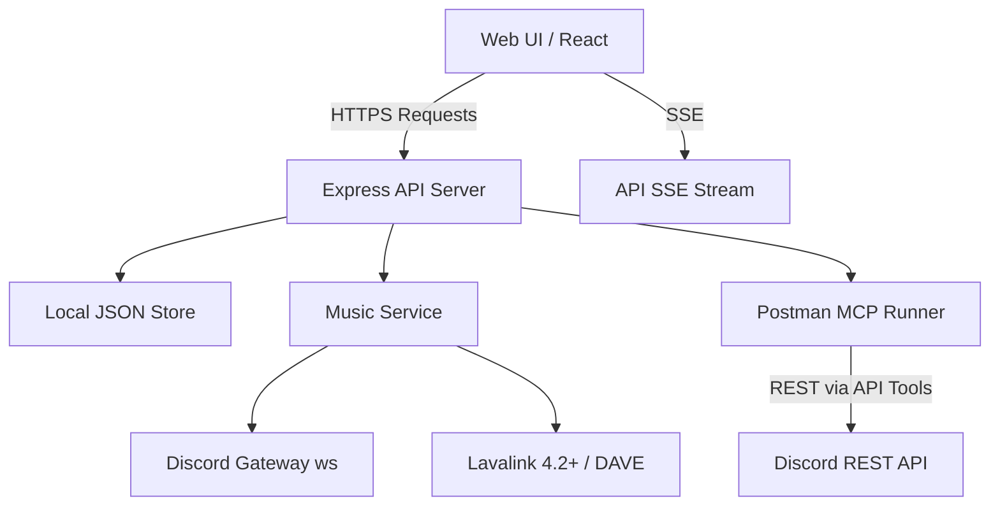

# Goofy Discord: Postman MCP + Music Bot

A public learning project demonstrating how to build a modern Discord bot and web application using **Postman MCP (Model Context Protocol)** for Discord REST API interactions.

## Project Guidelines

*   **Public Source for Learning:** This repository is intended for educational purposes. The code prioritizes readability, modularity, and beginner-friendliness.
*   **Postman MCP Focus:** Demonstrates how to use MCP tools to securely integrate with the Discord REST API rather than manually constructing HTTP requests or relying solely on bloated libraries.
*   **Clean & Safe:** No secrets are committed to the source. Follow standard `.env` practices.

## Phases 1–5 Summary

| Phase | Description | Key Features |
| :--- | :--- | :--- |
| **Phase 1** | Basic Jukebox | OAuth sign-in, join/play/skip/pause, Lavalink 4.2+ (DAVE) integration. |
| **Phase 2** | Queue & Persistence | Move/remove/shuffle/repeat tracks. Per-guild JSON state storage. |
| **Phase 3** | Collaborative Real-time | Server-Sent Events (SSE) synchronization. History, Favorites, Mod auth. |
| **Phase 4** | Social Jukebox | Auto-leave, DJ Roulette, Mood Presets, Soundboard, Lyrics MVP, Karaoke filter, Vote skips. |
| **Phase 5** | MCP Expansion & Polish | `get_channel_messages`, `create_message` MCP tools. Chat polling requests, Track announcements. |

## Architecture Diagram

## Setup & Running

1. **Prerequisites:** Node.js (v20+), Lavalink 4.2+ server running locally (or configured remote).
2. **Configuration:** Copy `.env.example` to `.env` and fill in `BOT_TOKEN`, `CLIENT_ID`, `CLIENT_SECRET`, and Lavalink credentials.
3. **Install:** `npm install`
4. **Run Dev:** `npm run dev:stable` (Starts Vite + Express backend)
5. **Linting:** `npm run lint`
6. **Build:** `npm run build`

## API Endpoints (Music)

| Method | Route | Description |
| :--- | :--- | :--- |
| `GET` | `/api/music/stream` | SSE endpoint for real-time jukebox updates. |
| `POST` | `/api/music/join` | Joins the bot to a specified voice channel. |
| `POST` | `/api/music/play` | Searches and queues a track (or YouTube URL). |
| `POST` | `/api/music/skip` | Skips the current track (mod or requester only). |
| `POST` | `/api/music/pause` | Toggles pause state. |
| `POST` | `/api/music/leave` | Bot leaves voice and clears session. |
| `GET` | `/api/music/queue` | Returns current queue state. |
| `POST` | `/api/music/remove` | Removes a specific track by index. |
| `POST` | `/api/music/move` | Moves a track within the queue. |
| `POST` | `/api/music/clear` | Clears all upcoming tracks. |
| `POST` | `/api/music/shuffle` | Shuffles the upcoming queue. |
| `POST` | `/api/music/repeat` | Sets repeat mode (off/track/queue). |
| `POST` | `/api/music/autoplay` | Toggles autoplay (finds related tracks). |
| `POST` | `/api/music/play-next` | Queues a track to play immediately after the current one. |
| `GET` | `/api/music/history` | Gets the last 100 played tracks. |
| `POST` | `/api/music/favorites/play` | Plays a track from favorites. |
| `POST` | `/api/music/roulette/pick` | Picks a random active VC member. |
| `POST` | `/api/music/mood` | Plays a curated list of tracks based on mood. |
| `GET` | `/api/music/soundboard` | Lists available short audio clips. |
| `POST` | `/api/music/soundboard/play` | Plays a short sound clip over the music. |
| `GET` | `/api/music/lyrics` | Retrieves lyrics for a playing track. |
| `POST` | `/api/music/karaoke` | Toggles vocal reduction audio filter. |
| `POST` | `/api/music/vote/skip` | Cast a vote to skip current track (requires 2+ votes). |
| `POST` | `/api/music/settings/announce` | Sets the text channel to post "Now Playing" messages. |

## Known Limitations

*   **Lyrics MVP:** Scrapes metadata and relies on `lyrics.ovh`. May not find lyrics for heavily remixed tracks or non-standard naming.
*   **Soundboard MVP:** Temporarily pauses the current track to play the clip on the single Lavalink player, then resumes.
*   **Chat Polling:** Currently polls messages every 10 seconds via MCP to demonstrate REST-based chat processing (a production bot would use Gateway events).
