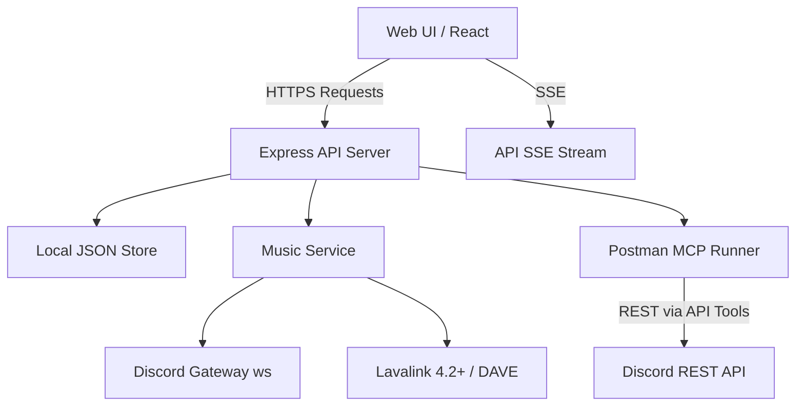

# Goofy Discord: Postman MCP + Music Bot

A public learning project demonstrating how to build a modern Discord bot and web application using **Postman MCP (Model Context Protocol)** for Discord REST API interactions.

## Project Guidelines

*   **Public Source for Learning:** This repository is intended for educational purposes. The code prioritizes readability, modularity, and beginner-friendliness.
*   **Postman MCP Focus:** Demonstrates how to use MCP tools to securely integrate with the Discord REST API rather than manually constructing HTTP requests or relying solely on bloated libraries.
*   **Clean & Safe:** No secrets are committed to the source. Follow standard `.env` practices.

## Phases 1–5 Summary

| Phase | Description | Key Features |
| :--- | :--- | :--- |
| **Phase 1** | Basic Jukebox | OAuth sign-in, join/play/skip/pause, Lavalink 4.2+ (DAVE) integration. |
| **Phase 2** | Queue & Persistence | Move/remove/shuffle/repeat tracks. Per-guild JSON state storage. |
| **Phase 3** | Collaborative Real-time | Server-Sent Events (SSE) synchronization. History, Favorites, Mod auth. |
| **Phase 4** | Social Jukebox (foundation) | Chat `!play` via MCP polling, announce channel setting. Roulette/mood/soundboard/voting: roadmap. |
| **Phase 5** | MCP Expansion (foundation) | `get_channel_messages` MCP tool, educational chat listener pattern. |

## Architecture Diagram

## Setup & Running

1. **Prerequisites:** Node.js (v20+), Lavalink 4.2+ server running locally (or configured remote).
2. **Configuration:** Copy `.env.example` to `.env` and fill in `BOT_TOKEN`, `CLIENT_ID`, `CLIENT_SECRET`, and Lavalink credentials.
3. **Install:** `npm install`
4. **Run Dev:** `npm run dev:stable` (Starts Vite + Express backend)
5. **Linting:** `npm run lint`
6. **Build:** `npm run build`

## API Endpoints (Music)

| Method | Route | Description |
| :--- | :--- | :--- |
| `GET` | `/api/music/stream` | SSE endpoint for real-time jukebox updates. |
| `POST` | `/api/music/join` | Joins the bot to a specified voice channel. |
| `POST` | `/api/music/play` | Searches and queues a track (or YouTube URL). |
| `POST` | `/api/music/skip` | Skips the current track (mod or requester only). |
| `POST` | `/api/music/pause` | Toggles pause state. |
| `POST` | `/api/music/leave` | Bot leaves voice and clears session. |
| `GET` | `/api/music/queue` | Returns current queue state. |
| `POST` | `/api/music/remove` | Removes a specific track by index. |
| `POST` | `/api/music/move` | Moves a track within the queue. |
| `POST` | `/api/music/clear` | Clears all upcoming tracks. |
| `POST` | `/api/music/shuffle` | Shuffles the upcoming queue. |
| `POST` | `/api/music/repeat` | Sets repeat mode (off/track/queue). |
| `POST` | `/api/music/autoplay` | Toggles autoplay (finds related tracks). |
| `POST` | `/api/music/play-next` | Queues a track to play immediately after the current one. |
| `GET` | `/api/music/history` | Gets the last 100 played tracks. |
| `POST` | `/api/music/favorites/play` | Plays a track from favorites. |
| `POST` | `/api/music/settings/announce` | Sets text channel for now-playing embeds and chat `!play` polling. |
| `POST` | `/api/music/karaoke` | Toggle karaoke (vocal reduction) filter. |
| `POST` | `/api/music/dj-roulette/spin` | Pick a random DJ from the voice channel. |
| `POST` | `/api/music/dj-roulette/toggle` | Enable/disable DJ Roulette mode. |
| `GET` | `/api/music/soundboard` | List available soundboard clips. |
| `POST` | `/api/music/soundboard/play` | Play a soundboard clip over current music. |
| `GET` | `/api/music/lyrics` | Fetch lyrics for the now-playing track. |
| `GET` | `/api/music/mood-playlists` | List DJ mood playlist presets. |
| `POST` | `/api/music/mood-playlists/queue` | Apply mood filter and queue playlist tracks. |
| `POST` | `/api/music/soundboard/upload` | Upload a custom soundboard clip (base64, max 2 MB). |
| `DELETE` | `/api/music/soundboard/upload` | Remove a custom soundboard clip. |
| `GET` | `/api/soundboard/files/:guildId/:filename` | Serve uploaded sound files for Lavalink. |
| `GET` | `/api/metrics` | Prometheus metrics for the API process. |

### Phase 4–5 shipped in this merge

- **Chat requests:** Bot polls `get_channel_messages` MCP tool every 10s when `announceChannelId` is set in guild JSON; `!play <query>` queues tracks.
- **Announce setting:** `POST /api/music/settings/announce` with `{ guildId, musicChannelId, announceChannelId }` — also configurable in the Jukebox UI.
- **Now-playing embeds:** `create-message.js` MCP tool posts embeds to the announce channel when a track starts.
- **Auto-leave:** Bot leaves after 2 minutes in an empty voice channel.
- **Vote-skip:** Majority vote in VC to skip; mods/requester force-skip.
- **Mood presets:** Lavalink filters (Chill, Nightcore, Bass Boost, 8D).
- **Karaoke:** Vocal-reduction filter toggle.
- **DJ Roulette:** Random VC listener becomes DJ; only they (or mods) can queue until next spin.
- **Soundboard:** Short SFX clips mix over music (duck + resume).
- **Lyrics:** Fetched from LRCLIB for the now-playing track.
- **Metrics:** `GET /api/metrics` (Prometheus text format).
- **MCP tool:** `get_channel_messages` in `discord-mcp/tools/pan-mcp/discord-rest-api/`.

### Roadmap (optional next)

All prior roadmap items are now shipped. Optional polish: synced lyrics karaoke-style scroll-to-line, guild-specific mood playlist editor UI.

- **Mood playlists:** Preset genre searches + mood filter applied (`GET /api/music/mood-playlists`, `POST /api/music/mood-playlists/queue`).
- **Custom sound uploads:** Per-guild clips via Jukebox UI (`POST /api/music/soundboard/upload`, max 2 MB).
- **Synced LRC lyrics:** Timed line highlighting driven by playback position.

## Known Limitations

*   **Chat Polling:** Polls messages every 10 seconds via MCP when `announceChannelId` is configured (production bots typically use Gateway events).
*   **Phase 4–5 partial:** Social features beyond chat requests are documented as roadmap items above.
